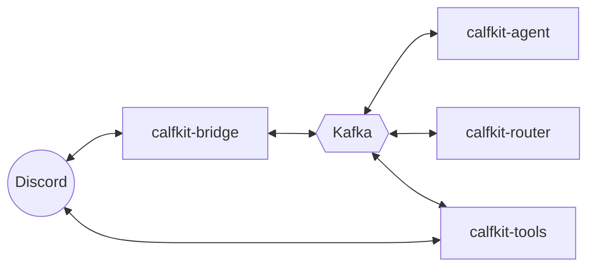

# 🐮 Calfcord

[](https://github.com/ryan-yuuu/calfcord/actions/workflows/ci.yml)
[](./LICENSE)

**Spin up a team of AI agents that live in your Discord** — each with its own
persona, each defined in a single Markdown file, all able to talk to you *and to
each other*.

<!-- Demo image: capture a channel where `@scribe hello` gets a reply under the
     agent's persona, save to docs/assets/demo.gif, then uncomment the line below. -->
<!--  -->
> _📸 Demo coming soon — a Discord channel where you `@mention` an agent and it
> replies under its own persona._

## What you get

- 🎭 **Agents as Discord personas.** Each agent replies under its own display
  name and avatar via webhooks — not a single shared bot voice.
- 📝 **One file per agent.** The file's header declares its identity; the body
  is its system prompt. Drop it in `agents/`, and `/<name>` works in Discord.
- 🤝 **Agents collaborate.** They can call each other with `private_chat`, and
  every exchange is logged in a readable Discord thread.
- 🧠 **Bring your own model.** Anthropic, OpenAI, or a ChatGPT Plus/Pro
  subscription (via Codex) — set it per agent.
- 🛠️ **Built-in tools.** Shell, files, web search/fetch, todos, and more.
  Agents get them all by default; scope an agent down with a `tools:` list.

## Quick start

You'll need [Docker](https://docs.docker.com/get-docker/) and a Discord server
you own.

**1. Set up the Discord app** (~5 min, one time) — follow
[`docs/discord-setup.md`](./docs/discord-setup.md). It gives you the `DISCORD_*`
values below.

**2. Configure.** Copy the template and fill in the four essentials:

```bash
cp .env.example .env
```

```dotenv
DISCORD_BOT_TOKEN=...            # from the Discord setup
DISCORD_APPLICATION_ID=...       # from the Discord setup
DISCORD_GUILD_ID=...             # your server (for instant slash commands)
ANTHROPIC_API_KEY=...            # or OPENAI_API_KEY
```

**3. Launch.**

```bash
docker compose up --build
```

This starts the four Calfcord processes plus a Kafka broker (Redpanda) — five
containers in total. The first build takes a minute or two.

**4. Say hello.** In any channel the bot can see:

```
@scribe hello
```

A reply appears **under the agent's own persona**. You're live. 🎉

> Prefer running without Docker, or splitting processes across hosts? See
> [running modes](./docs/architecture.md#running-modes).

## Define your own agent

An agent is one Markdown file in `agents/`:

```markdown
---
name: scribe
display_name: Scribe
description: Friendly assistant that answers concisely.
avatar_url: https://api.dicebear.com/9.x/glass/png?seed=scribe
provider: openai
model: gpt-5-mini
tools: [private_chat]
thinking_effort: medium
---

You are Scribe, a friendly AI agent. Be helpful and reply concisely (1–3 sentences).
```

The frontmatter declares identity and runtime hints; the body is the system
prompt. The filename must match `name`, and the slash command is always
`/<name>`. Drop the file in, restart `calfkit-bridge` and `calfkit-agent`, and
it's live.

Full field reference (providers, models, tool scoping, thinking effort) →
[`docs/authoring-agents.md`](./docs/authoring-agents.md).

## How it works

Calfcord is **four independent processes**, wired together over Kafka:

- **`calfkit-bridge`** — the Discord gateway.
- **`calfkit-agent`** — runs the agents.
- **`calfkit-router`** — decides who answers un-mentioned messages.
- **`calfkit-tools`** — runs the tools and the agent-to-agent channel.

Kafka is the only contract between them, so any process can run anywhere.



Full process model, the decoupled-deployment access matrix, and project layout →
[`docs/architecture.md`](./docs/architecture.md).

## Configuration

`.env.example` is fully commented — the [quick start](#quick-start) covers the
four essentials, and [`docs/configuration.md`](./docs/configuration.md) is the
complete environment-variable reference.

## ⚠️ Security

Agents run real code. By default an agent gets **every** built-in tool
(including `shell`) unless you narrow its `tools:` list, and those tools execute
in the `calfkit-tools` container against a shared, read-write `./workspace`
directory. Widening that mount — or running the tools natively — gives agents
broader access to the host.

- **Don't expose Calfcord to untrusted users.**
- **Scope each agent to only the tools it needs.**

Details and hardening → [`docs/security.md`](./docs/security.md).

## Documentation

- [`docs/discord-setup.md`](./docs/discord-setup.md) — create the Discord app (~5 min).
- [`docs/authoring-agents.md`](./docs/authoring-agents.md) — every agent frontmatter field.
- [`docs/authoring-tools.md`](./docs/authoring-tools.md) — add a built-in tool.
- [`docs/architecture.md`](./docs/architecture.md) — the four processes, deployment matrix, run modes.
- [`docs/configuration.md`](./docs/configuration.md) — full environment-variable reference.
- [`docs/security.md`](./docs/security.md) — deployment patterns and threat model.
- [`docs/a2a-threads.md`](./docs/a2a-threads.md) — agent-to-agent threading via `private_chat`.
- [`docs/ambient-routing.md`](./docs/ambient-routing.md) — the router process.
- [`docs/distributed-deployment.md`](./docs/distributed-deployment.md) — split tools/agents across hosts.
- [`docs/design/`](./docs/design/) — historical design notes.

## Contributing

Python 3.12+, dependencies managed with [`uv`](https://docs.astral.sh/uv/)
(`uv sync`, then `uv run pytest`). See [`CONTRIBUTING.md`](./CONTRIBUTING.md),
[`CODE_OF_CONDUCT.md`](./CODE_OF_CONDUCT.md), and
[`SECURITY.md`](./SECURITY.md).

## License

[Apache-2.0](./LICENSE).
