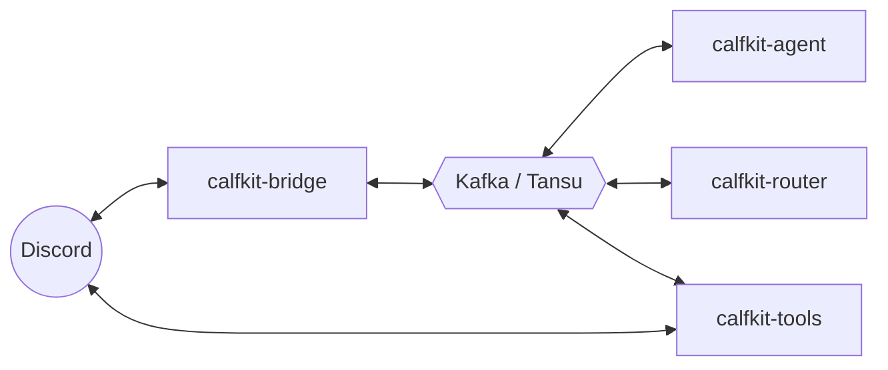

# Architecture

Calfcord is four independent processes that communicate **exclusively through
Kafka**. Each is safe to deploy on its own host, and switching between
deployment styles (all-in-Docker, all-native, or a mix) needs no code changes —
they share the same `.env` and `agents/*.md`.

## The four processes

- **`calfkit-bridge`** — the single Discord gateway. Loads the agent registry
  from `agents/*.md`, normalizes inbound Discord events to a wire format,
  publishes them to per-channel Kafka topics, and posts agent replies back to
  Discord as persona webhooks.
- **`calfkit-agent`** — runs one or all agents as calfkit `Agent` nodes. Each
  agent subscribes to its configured channel topics plus a private
  `agent.{agent_id}.in` inbox used for direct agent-to-agent (A2A) calls.
- **`calfkit-router`** — the ambient-channel router. Decides which agent (if
  any) should handle a non-`@`-mentioned message in a watched channel. It is
  **optional** — without it, `@mention` and slash messages still route directly
  to agents and only ambient messages go unanswered. Configure it with
  `calfcord router setup` (which sets `CALFKIT_ROUTER_PROVIDER` /
  `CALFKIT_ROUTER_MODEL`). See [`ambient-routing.md`](./ambient-routing.md).
- **`calfkit-tools`** — runs the A2A `private_chat` tool plus the built-in
  filesystem / shell / search / web / todo tools. Intentionally decoupled from
  the bridge (see below).

The only Discord-touching processes are the bridge (gateway + outbox) and the
tools runner (projection of A2A exchanges to a per-conversation thread under the
unified A2A channel — named `private-a2a-chats` by default, overridable via
`CALFKIT_A2A_CHANNEL_NAME`; the bundled `docker-compose.yml` sets `private-a2a`).



## Decoupled deployment

The four processes have intentionally different access requirements:

| Resource                              | Bridge | Agent           | Router | Tools |
|---------------------------------------|:------:|:---------------:|:------:|:-----:|
| `agents/*.md` (local files)           |   no   | yes (own only)  |   no   |  no   |
| Discord bot token (env var)           |   yes  | yes             |  yes   |  yes  |
| Kafka broker                          |   yes  | yes             |  yes   |  yes  |
| LLM provider API key                  |   —    | yes             |  yes   |  —    |

The tools deployment is **registry-free by design**. It has no read access to
`agents/*.md`. Agent identities (display name, avatar, description, tools)
arrive over Kafka in a `phonebook` field that the bridge places in every
invocation's `deps`. Calfkit propagates `deps` through agent → tool, so the
phonebook reaches `private_chat` with no local file dependency. Practical
consequences:

- The tools process can run on a host with no shared filesystem with the bridge.
- The bridge is the single source of truth for "what agents exist."
- Future hot-add support on the bridge's registry takes effect without any agent
  or tool restart.

For splitting tools and agents across multiple hosts (slim per-tool images via
`calfcord-package-tools`, the multi-host `--rename` pattern, and broker
auth/TLS), see [`distributed-deployment.md`](./distributed-deployment.md).

## Running modes

The primary end-user path is the **native installer**: `curl … | bash` drops a
`calfcord` shim under `~/.calfcord/`, then `calfcord init` walks you through
first-run config (provider, Discord, broker). On a native install the agent and
state directories are pinned under the install home — `CALFKIT_AGENTS_DIR` →
`~/.calfcord/agents` (your `.md` files survive `calfcord self update`) and
`CALFKIT_STATE_DIR` → `~/.calfcord/state/agents` — while the tools
**workspace follows the launch directory** (`CALFCORD_WORKSPACE_DIR` → the
`$PWD` of `calfcord run tools`, the Claude-Code model). See the
[README quick start](../README.md#quick-start) and
[`installation.md`](./installation.md) for the full walkthrough, and
[`configuration.md`](./configuration.md) for overriding any of those dirs.

Three modes work with the same `.env` and `agents/*.md`. The bare `uv run` and
Docker Compose paths below never see the shim and keep their CWD-relative
defaults (`agents/`, `state/agents/`, `state/workspace/`):

### Native (no Docker for calfcord)

```bash
uv sync                                              # install dependencies
calfcord broker                                      # native Tansu broker — or bring your own Kafka

# Add to .env so every uv-run terminal picks it up automatically:
echo 'CALF_HOST_URL=localhost:9092' >> .env

# Each in its own terminal (or process supervisor):
uv run calfkit-bridge
uv run calfkit-agent                                 # all agents on one Worker
# or for crash isolation per agent:
#   uv run calfkit-agent scribe
uv run calfkit-router
uv run calfkit-tools
```

`localhost:9092` is the default Kafka port the native Tansu broker listens on.
Skip `calfcord broker` if you have Kafka elsewhere — just point `CALF_HOST_URL`
at it. Tansu's default storage is ephemeral memory, so topics/messages reset on
broker restart and calfcord re-creates the topics it needs on startup. Writing
the value to `.env` rather than `export`ing it means every `uv run` terminal
picks it up via `python-dotenv` without a per-shell re-export.

### Mixing modes

Anything in between works too: run the bridge in compose while you iterate on the
agent locally, or the reverse. Each process reads `.env` independently, and a
shared Kafka broker is the only wire-format contract between them. Native-side
processes still need `CALF_HOST_URL=localhost:9092` in `.env`; containerized
services pick up `tansu:9092` from compose's per-service environment block. (To
run only the broker in Docker but the calfcord processes natively on the host,
advertise the host address: `TANSU_ADVERTISE=localhost docker compose up tansu`,
then point the native processes at `localhost:9092`.)

### Worker lifecycle (calfkit-managed)

All five worker-bearing processes (the four above plus the standalone
`calfkit-mcp` runner — a separate entry point, not wired into the default
compose) now run on calfkit's managed `Worker` lifecycle. Until calfkit 0.5.2 the
managed `Worker.run()` path couldn't publish lifecycle events at precise points
(agent presence / departure announcements), co-run a second foreground service
(the bridge's Discord gateway), or cede OS-signal ownership to the application —
so the bridge and `calfkit-agent` hand-rolled their own start/serve/drain loops.
calfkit 0.5.2/0.5.4 closed those gaps
([calfkit-sdk #175](https://github.com/calf-ai/calfkit-sdk/pull/175)) and
calfcord adopted the managed path:

- **The four standalone runners** (`calfkit-agent`, `calfkit-router`,
  `calfkit-tools`, `calfkit-mcp`) call `await worker.run()`. The Worker owns the
  whole loop: register handlers → provision node topics → `broker.start()` (block
  until consumer groups join) → serve → drain → stop, with SIGINT/SIGTERM handled
  for them. A clean return happens *only* on a signal; a startup failure
  propagates as a non-zero exit for the supervisor to restart.
- **`calfkit-agent`** publishes presence declaratively via `@worker.after_startup`
  (announce, after the producer is live) and `@worker.on_shutdown` (depart, before
  the drain) hooks, replacing the old imperative loop.
- **The bridge** embeds the Discord gateway as its real foreground, so it composes
  the worker with `async with worker:` (which installs no signal handlers — the
  bridge keeps owning shutdown ordering) and runs the gateway alongside it under
  its own `asyncio.wait` race.

calfcord's only remaining deviation from vanilla calfkit lifecycle is
`_provisioning.provision_infra`, called once before `run()` / `async with worker`:
it creates the topics calfkit's node-walking provisioner can't see — the
single-partition `agent.steps` topic, the raw control-plane topics, the
no-subscriber ambient-discard topic, and the client reply topic (the latter
working around the still-open
[calfkit-sdk #180](https://github.com/calf-ai/calfkit-sdk/issues/180) on
no-auto-create brokers). The full adoption rationale is in
[`design/calfkit-0.5.4-lifecycle-adoption.md`](./design/calfkit-0.5.4-lifecycle-adoption.md);
the now-closed upstream gaps it built on are in
[`design/calfkit-worker-lifecycle-gaps.md`](./design/calfkit-worker-lifecycle-gaps.md).

## Agent-to-agent communication

The `private_chat` tool lets one agent's LLM send a message to another agent and
receive their reply. Kafka is the system of record; Discord is a human-readable
audit log. When agent A calls `private_chat(target_agent_id="bob", content="…")`,
the tool posts A's request as A's persona, anchors (or reuses) a Discord
**thread** under the unified A2A channel, invokes `agent.bob.in` via
calfkit RPC (60-second default timeout), posts B's reply into the same thread,
and returns the response to A's LLM tagged with a `<thread_id>` so A can continue
the conversation later.

The bridge injects a `temp_instructions` block listing available peers whenever
it invokes an agent that has `private_chat` in its tools, so the LLM knows who it
can call without trial-and-error. Timeouts return as LLM-readable error strings;
infrastructure failures raise `RuntimeError` with caller/target/correlation
context.

See [`a2a-threads.md`](./a2a-threads.md) for the full thread-projection design.

## Project layout

```
src/calfcord/
├── agents/        # definition, factory, runner, state, gates, routing,
│                  # peer_roster, phonebook, thinking, identifier,
│                  # loader, md_writer
├── bridge/        # gateway, ingress, outbox, egress, normalizer,
│                  # registry, history, slash, synthesized, wire,
│                  # pending_wires
├── discord/       # client wrappers (sender, persona, receiver,
│                  # settings, messages, retry_feedback)
├── router/        # ambient-channel routing agent (definition, runner,
│                  # roster, fanout, prompt)
└── tools/
    ├── builtin/   # shipped tools — fs, search, shell, web, todos,
    │              # private_chat, plus _observation / workspace helpers
    ├── discovery.py  # auto-discovery loader (walks builtin/ at import)
    └── runner.py     # calfkit-tools entry point

agents/                 # agent .md definitions (live)
state/agents/           # per-agent runtime state (channel subscriptions)
docs/                   # authoring guides + security model + design archive
.github/                # CI/CD workflows + Dependabot + issue/PR templates
Dockerfile, docker-compose.yml  # deployment
tests/                  # pytest suite
```
