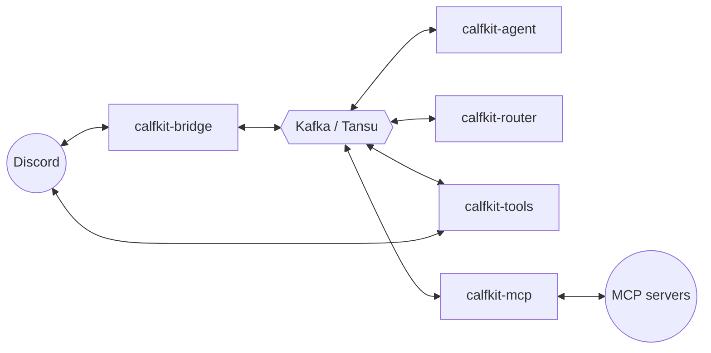

# Architecture

Calfcord is a set of independent processes that communicate **exclusively
through Kafka**. Each is safe to deploy on its own host, and switching between
deployment styles (supervised native, all-in-Docker, or a mix) needs no code
changes — they share the same `.env` and `agents/*.md`.

Two layers sit on top of those processes — a **substrate** that is always on and
a **roster** of teammates that clock in and out. The
[runtime model](#runtime-model-substrate--roster) below is how you operate them;
the process list and decoupling invariants that follow are what is actually
running underneath.

## The five processes

- **`calfkit-bridge`** — the single Discord gateway. Loads the agent registry
  from `agents/*.md`, normalizes inbound Discord events to a wire format,
  publishes them to per-channel Kafka topics, and posts agent replies back to
  Discord as persona webhooks.
- **`calfkit-agent`** — runs one or all agents as calfkit `Agent` nodes. Each
  agent subscribes to its configured channel topics plus a private
  `agent.{agent_id}.in` inbox used for direct agent-to-agent (A2A) calls.
- **`calfkit-router`** — the ambient-channel router. Decides which agent (if
  any) should handle a non-`@`-mentioned message in a watched channel. It is
  **optional** — without it, `@mention` and slash messages still route directly
  to agents and only ambient messages go unanswered. Configure it with
  `calfcord router edit` (which sets `CALFKIT_ROUTER_PROVIDER` /
  `CALFKIT_ROUTER_MODEL`), then bring it online with `calfcord router start`.
  See [`ambient-routing.md`](./ambient-routing.md).
- **`calfkit-tools`** — runs the A2A `private_chat` tool plus the vendored
  `calfkit-tools` nodes: terminal / process / filesystem / search / code-execution
  / web / todo tools. Intentionally decoupled from the bridge (see below).
- **`calfkit-mcp`** — one MCP server's toolbox. Each server in
  `mcp.json` becomes its own process (slot `mcp-<server>`) that connects to that
  external [Model Context Protocol](https://modelcontextprotocol.io) server,
  lists its tools, and advertises them on the compacted `mcp.capabilities`
  topic. One process per server is deliberate: a toolbox whose server is
  unreachable fails its own worker at boot, so one bad entry can't take down
  sibling servers. Agents pick the tools up from the advertisement, never the
  config — see [`mcp-tools.md`](./mcp-tools.md).

The only Discord-touching processes are the bridge (gateway + outbox) and the
tools runner (projection of A2A exchanges to a per-conversation thread under the
unified A2A channel — named `private-a2a-chats` by default, overridable via
`CALFKIT_A2A_CHANNEL_NAME`; the bundled `docker-compose.yml` sets `private-a2a`).



## Decoupled deployment

The five processes have intentionally different access requirements:

| Resource                              | Bridge | Agent           | Router | Tools | MCP |
|---------------------------------------|:------:|:---------------:|:------:|:-----:|:---:|
| `agents/*.md` (local files)           |   no   | yes (own only)  |   no   |  no   | no  |
| `mcp.json` + MCP secrets              |   no   | no              |   no   |  no   | yes |
| Discord bot token (env var)           |   yes  | yes             |  yes   |  yes  | no  |
| Kafka broker                          |   yes  | yes             |  yes   |  yes  | yes |
| LLM provider API key                  |   —    | yes             |  yes   |  —    | —   |

The tools deployment is **registry-free by design**. It has no read access to
`agents/*.md`. Agent identities (display name, avatar, description, tools)
arrive over Kafka in a `phonebook` field that the bridge places in every
invocation's `deps`. Calfkit propagates `deps` through agent → tool, so the
phonebook reaches `private_chat` with no local file dependency. Practical
consequences:

- The tools process can run on a host with no shared filesystem with the bridge.
- The bridge is the single source of truth for "what agents exist."
- Future hot-add support on the bridge's registry takes effect without any agent
  or tool restart.

For splitting tools and agents across multiple hosts (slim per-tool images via
`calfcord-package-tools`, the multi-host `--rename` pattern, and broker
auth/TLS), see [`distributed-deployment.md`](./distributed-deployment.md).

### The MCP secrets boundary

`calfkit-mcp` extends the same decoupling to external tools, and adds a secrets
boundary the table above shows: **only the `mcp-<server>` processes read
`mcp.json`** (the commands, URLs, and credentials). Each toolbox advertises its
tools — names, JSON schemas, and a dispatch topic — onto the compacted
`mcp.capabilities` control-plane topic. Agents resolve their `mcp/...`
selectors against that capability view **per turn**, never against the config
file, so:

- agent hosts need no `mcp.json` and hold no MCP secrets — the credentials stay
  on the host running the server;
- a server's tool list can change with no agent restart (runtime discovery);
- a down server degrades the affected turn with a warning instead of blocking
  the agent (selection is non-strict).

See [`mcp-tools.md`](./mcp-tools.md) for the full lifecycle and selector
grammar, and [`design/mcp-reintroduction.md`](./design/mcp-reintroduction.md)
for the rationale.

## Runtime model: substrate + roster

The processes above are the *what*; this is the *how you run them*. Calfcord
splits the running system into two layers so the always-on plumbing is separate
from the teammates you stand up on demand:

- **Substrate** — the **broker** (Kafka / Tansu) and the **bridge**. This is the
  office: the message bus plus the single Discord gateway. `calfcord start`
  brings up *only* the substrate, detached and **health-gated** — it does not
  return until the bridge reports it is connected to Discord (the bridge writes
  its first heartbeat on Discord `on_ready`, so "substrate healthy" *means*
  "connected to Discord"). The broker is a fast-fail precondition; the bridge
  readiness is what the gate waits on.
- **Roster** — the **agents**, **tools**, and **router** hosts. These
  are the teammates that clock into the live office. `start` deliberately does
  **not** auto-start any roster member — "nothing runs that you didn't start" is
  a trust property — so you bring each one online explicitly: `calfcord agent
  start <name>`, `calfcord router start`, `calfcord tools start` (and the
  matching `stop`). `calfcord agent restart <name>` reloads a running agent
  after you edit its `.md`.

The minimum path to a live agent is two honest commands — open the office, then
clock a teammate in:

```bash
calfcord start                  # substrate only (broker + bridge), health-gated
calfcord agent start assistant  # roster: a teammate joins the live org → replies in Discord
```

`calfcord init` runs this whole sequence for a newcomer, walking both layers
visibly so the substrate↔roster split is learned by doing it. After that,
`calfcord status` is the org board (substrate health + which roster members are
online), `calfcord agent ps` shows what is *running* now (vs. `agent list`, which
shows what is *defined* on disk), and `calfcord logs [component] [-f]` tails the
unified or per-component logs.

### Process Compose supervises one host

On a single host the substrate and roster are managed by
**[Process Compose](https://f1bonacc1.github.io/process-compose)**, a
cross-platform single-binary supervisor that calfcord bootstraps the same way it
bootstraps the Tansu broker (a pinned binary under `$CALFCORD_HOME/bin`, kept out
of the agent Python path). The supervisor configuration is **derived state**:
calfcord generates `$CALFCORD_HOME/state/process-compose.yaml` from your
`agents/*.md` and config — you never hand-edit it. The CLI verbs are a thin
veneer over the supervisor's REST API.

This is where the layer split becomes mechanical. In the generated config the
substrate (broker, bridge) is declared `autostart`, while every defined agent,
plus tools and router, is declared but **disabled** — present but not
started until you run its `start`. The supervisor absorbs the lifecycle work
calfcord would otherwise hand-roll:

- **Dependency ordering and health gates** — `depends_on` keeps the bridge from
  starting until the broker is healthy, and keeps roster members waiting on the
  substrate. Both the dependency gates and the `start` readiness poll are driven
  by the *same* signal: an exec readiness probe that runs
  `calfcord _healthcheck <component>` against the per-component heartbeat files
  under `$CALFCORD_HOME/state/health/`.
- **Autorestart** — the broker and bridge exit 0 on a clean return, so they use
  `restart: always`; the whole roster (agents, tools, router, MCP servers) runs
  on the [`run_worker_until_signal`](../src/calfcord/_worker_runtime.py) helper
  that forces a non-zero exit on a clean, signal-less return, so it uses
  `restart: on_failure`. An intentional `stop` does not trigger a restart.
- **Per-process log capture** — each component's stdout/stderr lands at
  `$CALFCORD_HOME/state/logs/<component>.log` (what `calfcord logs` tails).

### The same commands graduate to distributed

The substrate/roster model is host-agnostic. The substrate just needs to be
reachable over a broker URL, so graduating from one host to many does not change
the commands — it changes *where the broker is*. Point a second host's
`CALF_HOST_URL` at the shared substrate (`calfcord self set-broker <url>`) and
the same `calfcord agent start <name>` / `calfcord tools start` clock a teammate
into the *same* live org from a different machine. Idempotency is enforced
org-wide over the broker, not per host: `agent start` first probes the live
`agent.state` roster across the broker, so it will not start a duplicate of an
agent that is already running anywhere in the organization.

For the multi-host walkthrough (per-host broker config, slim per-role images, and
broker auth/TLS) see
[`distributed-deployment.md`](./distributed-deployment.md).

## Running modes

The same processes can run three ways, all sharing one `.env` and `agents/*.md`.
Pick by intent — operating an install, hacking on the source, or containerizing.

### 1. Supervised native (primary)

The end-user path. The native installer (`curl … | bash`) drops a `calfcord`
shim under `~/.calfcord/`; `calfcord init` walks you through first-run config and
ends with your first agent online. From then on you operate the
[substrate and roster](#runtime-model-substrate--roster) through the shim, and
**Process Compose supervises everything on the host** — health-gated startup,
dependency ordering, autorestart, and per-component logs, no terminal-juggling:

```bash
calfcord start                  # substrate (broker + bridge), detached, health-gated
calfcord agent start assistant  # roster: clock a teammate in → replies in Discord
calfcord status                 # org board: substrate + roster health
calfcord logs -f                # follow the unified supervisor log
calfcord stop                   # close the office (stops the supervised substrate)
```

On a native install the agent and state directories are pinned under the install
home so they survive `calfcord self update` and are found from any directory —
`CALFKIT_AGENTS_DIR` → `~/.calfcord/agents`, `CALFKIT_STATE_DIR` →
`~/.calfcord/state/agents` — while the tools **workspace follows the launch
directory** (`CALFCORD_WORKSPACE_DIR` defaults to the `$PWD` where the substrate
was launched, the Claude-Code model — agents act where you opened the office).
See the [README quick start](../README.md#quick-start) and
[`installation.md`](./installation.md) for the walkthrough, and
[`configuration.md`](./configuration.md) for overriding any of those dirs.

### 2. Low-level `uv run` (development)

For working *on* calfcord, you can run each process in the foreground yourself,
bypassing the shim and the supervisor. This is the dev/debug path; it keeps the
CWD-relative defaults (`agents/`, `state/agents/`, `state/workspace/`):

```bash
uv sync                                              # install dependencies
calfcord broker                                      # native Tansu broker — or bring your own Kafka

# Add to .env so every uv-run terminal picks it up automatically:
echo 'CALF_HOST_URL=localhost:9092' >> .env

# Each in its own terminal:
uv run calfkit-bridge
uv run calfkit-agent                                 # all agents on one Worker
# or for crash isolation per agent:
#   uv run calfkit-agent scribe
uv run calfkit-router
uv run calfkit-tools
uv run calfkit-mcp <server>                          # one MCP server from mcp.json (dev: ./mcp.json)
```

`localhost:9092` is the default Kafka port the native Tansu broker listens on.
Skip `calfcord broker` if you have Kafka elsewhere — just point `CALF_HOST_URL`
at it. Tansu's default storage is ephemeral memory, so topics/messages reset on
broker restart and calfcord re-creates the topics it needs on startup. Writing
the value to `.env` rather than `export`ing it means every `uv run` terminal
picks it up via `python-dotenv` without a per-shell re-export.

> The `calfcord broker` and `calfcord run <bridge|agent|router|tools|mcp>` shim
> verbs are the same low-level escape hatches surfaced for when you want one
> process in the foreground without the supervisor. The supervised native path
> above is what most installs use.

### 3. Docker (advanced)

The bundled `docker-compose.yml` runs the broker and each process as a service,
which is the right tier when you want containerized isolation or a reproducible
image build. Each process reads `.env` independently, and a shared Kafka broker
is the only wire-format contract between them, so modes also **mix**: run the
bridge in compose while you iterate on an agent natively, or the reverse.
Native-side processes need `CALF_HOST_URL=localhost:9092` in `.env`; containerized
services pick up `tansu:9092` from compose's per-service environment block. (To
run only the broker in Docker but the calfcord processes natively on the host,
advertise the host address: `TANSU_ADVERTISE=localhost docker compose up tansu`,
then point the native processes at `localhost:9092`.)

For unattended production hosts, `calfcord deploy <systemd|k8s|docker>` renders
the matching manifests (a systemd unit, Kubernetes resources, or a Docker
artifact) from your current config and agents, so you can hand the supervised
model off to the host's own init system or an orchestrator. See
[`distributed-deployment.md`](./distributed-deployment.md).

### Worker lifecycle

Every Kafka-hosting process now runs on calfkit 0.6.0's **managed** `Worker`
lifecycle, so start/serve/drain (and topic provisioning) live in one place
instead of five hand-rolled loops:

- **tools / router / `calfkit-agent`** use the blocking `Worker.run()` (it owns
  the foreground and OS signals) via the shared
  [`run_worker_until_signal`](../src/calfcord/_worker_runtime.py) helper.
  `calfkit-agent` publishes its presence / departure control-plane events from
  `after_startup` / `on_shutdown` lifecycle hooks (producer live at exactly those
  points), and declares its blind-spot topics from an `on_startup` hook.
- **the bridge** is the single deliberate **embedded** variant: it co-runs the
  Discord gateway (a foreground WebSocket) and owns SIGINT/SIGTERM, so it drives
  the worker via the non-blocking, signal-free `Worker.start()` / `Worker.stop()`
  surface, keeping its own signal handling and ordered shutdown. Its blind-spot
  topics are declared from an `on_startup` hook, and the raw state-consumer
  subscriber is registered before `start()` so every consumer group joins before
  the gateway accepts Discord events (register-before-serve).

The historical analysis of the gaps that forced the old hand-rolled loops — and
the upstream feature requests that closed them
([calfkit-sdk #165–#168](https://github.com/calf-ai/calfkit-sdk/issues/165)) —
is kept for reference in
[`design/calfkit-worker-lifecycle-gaps.md`](./design/calfkit-worker-lifecycle-gaps.md).

## Agent-to-agent communication

The `private_chat` tool lets one agent's LLM send a message to another agent and
receive their reply. Kafka is the system of record; Discord is a human-readable
audit log. When agent A calls `private_chat(target_agent_id="bob", content="…")`,
the tool posts A's request as A's persona, anchors (or reuses) a Discord
**thread** under the unified A2A channel, invokes `agent.bob.in` via
calfkit RPC (60-second default timeout), posts B's reply into the same thread,
and returns the response to A's LLM tagged with a `<thread_id>` so A can continue
the conversation later.

The bridge injects a `temp_instructions` block listing available peers whenever
it invokes an agent that has `private_chat` in its tools, so the LLM knows who it
can call without trial-and-error. Timeouts return as LLM-readable error strings;
infrastructure failures raise `RuntimeError` with caller/target/correlation
context.

See [`a2a-threads.md`](./a2a-threads.md) for the full thread-projection design.

## Project layout

```
src/calfcord/
├── agents/        # definition, factory, runner, state, gates, routing,
│                  # peer_roster, phonebook, thinking, identifier,
│                  # loader, md_writer
├── bridge/        # gateway, ingress, outbox, egress, normalizer,
│                  # registry, history, slash, synthesized, wire,
│                  # pending_wires
├── discord/       # client wrappers (sender, persona, receiver,
│                  # settings, messages, retry_feedback)
├── router/        # ambient-channel routing agent (definition, runner,
│                  # roster, fanout, prompt)
├── tools/
│   ├── __init__.py       # explicit tool surface (ALL_TOOLS) — vendored
│   │                     # calfkit-tools nodes + first-party private_chat
│   ├── deploy_filters.py # pure INCLUDE/ALIAS transform -> TOOL_REGISTRY
│   ├── private_chat.py   # first-party A2A tool (not vendorable)
│   └── runner.py         # calfkit-tools entry point
└── mcp/           # MCP integration: selector (frontmatter grammar),
                   # agent_select (frontmatter -> per-server toolbox refs),
                   # config (mcp.json loader), runner (calfkit-mcp entry
                   # point)

agents/                 # agent .md definitions (live)
config/mcp.json         # MCP server registry (native install; 0600)
state/agents/           # per-agent runtime state (channel subscriptions)
docs/                   # authoring guides + security model + design archive
.github/                # CI/CD workflows + Dependabot + issue/PR templates
Dockerfile, docker-compose.yml  # deployment
tests/                  # pytest suite
```
